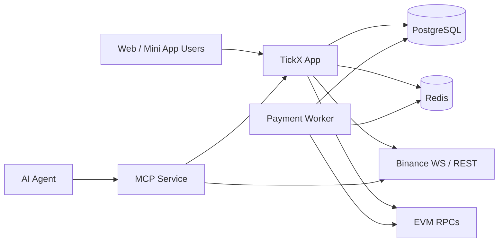

# TickX Backend

Backend for **TickX**, built with NestJS, TypeScript, PostgreSQL, Redis, websocket market streams, and EVM integrations.

This repo currently contains:
- the main API and socket server
- a separate payment worker process
- a separate MCP service for AI agents
- migration-managed relational storage
- Redis-backed runtime coordination and caching

## Architecture

### Runtime topology

| Process | Purpose | Default port |
|---|---|---:|
| `app` | User-facing REST API, websocket gateway, pricing, grid, orders, auth | `PORT` |
| `payment-worker` | Deposit/withdraw chain sync and withdrawal expiry jobs | `WORKER_PORT` |
| `mcp` | Agent-facing MCP HTTP server with `/mcp` and `/health` | `MCP_PORT` |

### Data and external dependencies

| Component | Role |
|---|---|
| PostgreSQL | Source of truth for orders, ledger history, payment history, auth metadata |
| Redis | Hot-path balance state, ledger sequencing, caches, transient auth/session coordination |
| Binance market data | Price ingestion for realtime price and grid generation |
| EVM RPCs | Onchain payment and signing integrations |



### Main backend domains

| Module | Responsibility |
|---|---|
| `auth` | Wallet login, mini-app login, JWT, WSS keys, auth profile metadata |
| `account` | Balance state, ledger append, locking, settlement credits/debits |
| `order` | Order placement, settlement, follow-trade fanout, human-verified win bonus |
| `payment` | Deposit/withdraw session handling and payment domain logic |
| `price` | Binance trade ingestion, price snapshots, OHLC aggregation |
| `grid` | Fortress grid generation, suggested strategy, diagnostics streams |
| `socket` | Realtime user, market, follow-trade, and diagnostics fanout |
| `settlement` | Settlement batch read models and payout projection APIs |
| `mcp` | Agent tool surface for login, funding, market reads, and betting |

## Feature Status

| Feature | Status | Notes |
|---|---|---|
| Wallet auth | ✅ Done | Challenge-sign login, JWT, WSS key flow |
| World mini-app auth | ✅ Done | Mini-app login + verify-human flow implemented |
| Human verified win bonus | ✅ Done | Applied at settlement, persisted as realized fields |
| Account balance locking in Redis | ✅ Done | Redis atomic flow with ledger sequencing |
| Fortress grid engine default | ✅ Done | Fortress is the default grid generation path |
| Suggested strategy stream | ✅ Done | Realtime stream with light randomness |
| Follow trade subscriptions | ✅ Done | DB registration + target-room websocket fanout |
| MCP agent betting surface | ✅ Done | Separate MCP process with `/mcp` and `/health` |
| Payment worker | ✅ Done | Separate process for chain sync / expiry |
| Additional agent skills / hosted skill docs | ✅ Done | `/skill.md` and `/skills/...` served by main app |
| Long-term hardening / scale tuning | ⏳ To Do | Observability, access policies, scale tuning, cleanup |

## Repository Layout

```text
.
├── src/
│   ├── config/
│   ├── libs/
│   ├── migrations/
│   ├── modules/
│   ├── scripts/
│   ├── main.ts
│   ├── payment-worker.ts
│   └── mcp.ts
├── skills/
├── system-design/
├── docker-compose.yml
├── docker.env
├── k8s-deployment.yml
└── README.md
```

## Prerequisites

- Node.js
- Yarn
- Docker + Docker Compose
- PostgreSQL and Redis, either via Docker Compose or external services

## Environment

At minimum, configure:

```env
NODE_ENV=development
PORT=5001
WORKER_PORT=5002
MCP_PORT=3010

POSTGRES_URL=postgres://...
REDIS_URL=redis://...

JWT_SECRET=...
RPCS=https://rpc1,https://rpc2
CLAIM_SIGNER_PRIVATE_KEY=

QUOTE_ASSET_ADDRESS=
RESERVE_POOL_ADDRESS=
```

For local Docker dependencies, use `docker.env` for PostgreSQL and Redis container settings.

## Local Setup

### 1. Start infra

```bash
docker compose --env-file docker.env up -d
```

### 2. Install dependencies

```bash
yarn install
```

### 3. Run migrations

```bash
yarn migration:up
```

### 4. Start processes

Main app:

```bash
yarn dev
```

Payment worker:

```bash
yarn dev:worker
```

MCP service:

```bash
yarn dev:mcp
```

## Production Commands

Main app:

```bash
node dist/main.js
```

Payment worker:

```bash
node dist/payment-worker.js
```

MCP service:

```bash
node dist/mcp.js
```

## Important Endpoints

### Main app

- Health: `/api/health-check`
- Swagger: `/swagger`
- API prefix: `/api/...`

### Payment worker

- Health: `/health`

### MCP service

- Health: `/health`
- MCP: `/mcp`

MCP is deployed on a separate host from the main app API.

## Notes

- For hackathon/demo mode, payment workers can be disabled and debug payment flows can be used instead.
- `grid_update` cells are signed; clients must use the emitted `gridSignature` unchanged.
- `order_update` settle payloads include realized payout breakdown when a win occurs:
  - `settledPayout`
  - `settledBasePayout`
  - `settledBonusPayout`
- Skill docs for agents are hosted by the main app:
  - `/skill.md`
  - `/skills/...`
